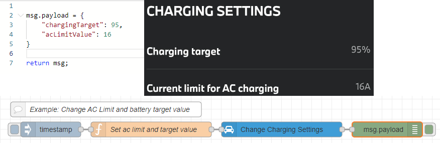

# Node-RED nodes for BMW ConnectedDrive

[](https://badge.fury.io/js/node-red-contrib-car-bmw)

This package contains nodes to easily connect to BMW ConnectedDrive and read out informations about your vehicles.

NOTE: These nodes are unofficial and do NOT COME from BMW AG. Be careful when using these.

Be careful not to send your login and password to anyone other than BMW or you are giving away the authentication details required to control your car.

Also ensure that you don't overwhelm the BMW servers with requests. Calling REST APIs at very high frequency can put substantial load on the servers and might get your IP blocked by BMW.

## Disclaimer

Use these nodes at your own risk. The authors do not guaranteed the proper functioning of these nodes.
This code attempts to use the same interfaces used by the official BMW ConnectedDrive web portal.
However, it is possible that use of this code may cause unexpected damage for which nobody but you are responsible.
Use of these functions can change the settings on your car and may have negative consequences such as (but not limited to)
reducing the available charge in the battery.

## Installation

Install using the managed palette from inside Node-RED.

## Usage

There are 3 new nodes which appear in the category 'BMW' in your Node-Red palette.


### BMW List

Reads the list of cars, that are assigned to a BMW ConnectedDrive account.

Example Output:

```JSON
{
    "vin": "WBA123456789",
    "mappingInfo": {
        "isAssociated": false,
        "isLmmEnabled": false,
        "mappingStatus": "CONFIRMED",
        "isPrimaryUser": true
    },
    "appVehicleType": "CONNECTED",
    "attributes": {
        "lastFetched": "2023-07-30T16:06:26.864Z",
        "model": "330e",
        "year": 2021,
        "color": 4283783516,
        "brand": "BMW",
        "driveTrain": "PLUGIN_HYBRID",
        "headUnitType": "MGU",
        "headUnitRaw": "HU_MGU",
        "hmiVersion": "ID7",
        "softwareVersionCurrent": {
            "puStep": {
                "month": 3,
                "year": 23
            },
            "iStep": 550,
            "seriesCluster": "S18A"
        },
        "softwareVersionExFactory": {
            "puStep": {
                "month": 3,
                "year": 21
            },
            "iStep": 530,
            "seriesCluster": "S18A"
        },
        "telematicsUnit": "ATM2",
        "bodyType": "G21",
        "countryOfOrigin": "DE",
        "driverGuideInfo": {
            "androidAppScheme": "com.bmwgroup.driversguide.row",
            "iosAppScheme": "bmwdriversguide:///open"
        }
    }
}
```

### BMW Get

Read different informations about your car.

Example Output:

```JSON
{
    "state": {
        "isLeftSteering": true,
        "lastFetched": "2023-07-30T15:51:17.326Z",
        "lastUpdatedAt": "2023-07-19T16:46:08Z",
        "isLscSupported": true,
        "range": 415,
        "doorsState": {
            "combinedSecurityState": "UNLOCKED",
            "leftFront": "CLOSED",
            "rightFront": "CLOSED",
            "combinedState": "CLOSED",
            "hood": "CLOSED",
            "trunk": "CLOSED"
        },
        "windowsState": {
            "leftFront": "CLOSED",
            "rightFront": "CLOSED",
            "combinedState": "CLOSED"
        },
        "location": {
            "coordinates": {
                "latitude": xx.yy,
                "longitude": ac.dc
            },
            "address": {
                "formatted": "Roßfeldstraße, 83471 Eck"
            },
            "heading": 190
        },
        "currentMileage": 72467,
        "requiredServices": [{
                "dateTime": "2023-10-01T00:00:00.000Z",
                "type": "BRAKE_FLUID",
                "status": "OK",
                "description": "Next service due by the specified date."
            }
        ],
        "checkControlMessages": [{
                "type": "ENGINE_OIL",
                "severity": "LOW"
            }
        ],
        "combustionFuelLevel": {
            "remainingFuelLiters": 37,
            "range": 415
        },
        "driverPreferences": {
            "lscPrivacyMode": "OFF"
        },
        "climateTimers": [{
                "isWeeklyTimer": false,
                "timerAction": "DEACTIVATE",
                "timerWeekDays": [],
                "departureTime": {
                    "hour": 7,
                    "minute": 0
                }
            }, {
                "isWeeklyTimer": true,
                "timerAction": "DEACTIVATE",
                "timerWeekDays": [
                    "MONDAY"
                ],
                "departureTime": {
                    "hour": 7,
                    "minute": 0
                }
            }, {
                "isWeeklyTimer": true,
                "timerAction": "DEACTIVATE",
                "timerWeekDays": [
                    "MONDAY"
                ],
                "departureTime": {
                    "hour": 7,
                    "minute": 0
                }
            }
        ]
    },
    "capabilities": {
        "a4aType": "BLUETOOTH",
        "climateNow": true,
        "isClimateTimerSupported": true,
        "climateTimerTrigger": "START_TIMER",
        "climateFunction": "VENTILATION",
        "horn": true,
        "isBmwChargingSupported": false,
        "isCarSharingSupported": false,
        "isChargeNowForBusinessSupported": false,
        "isChargingHistorySupported": false,
        "isChargingHospitalityEnabled": false,
        "isChargingLoudnessEnabled": false,
        "isChargingPlanSupported": false,
        "isChargingPowerLimitEnabled": false,
        "isChargingSettingsEnabled": false,
        "isChargingTargetSocEnabled": false,
        "isCustomerEsimSupported": false,
        "isDataPrivacyEnabled": false,
        "isDCSContractManagementSupported": false,
        "isEasyChargeEnabled": false,
        "isMiniChargingSupported": false,
        "isEvGoChargingSupported": false,
        "isRemoteHistoryDeletionSupported": false,
        "isRemoteEngineStartSupported": false,
        "isRemoteServicesActivationRequired": false,
        "isRemoteServicesBookingRequired": false,
        "isScanAndChargeSupported": false,
        "lastStateCallState": "ACTIVATED",
        "lights": true,
        "lock": true,
        "sendPoi": true,
        "unlock": true,
        "vehicleFinder": true,
        "vehicleStateSource": "LAST_STATE_CALL",
        "isRemoteHistorySupported": true,
        "isWifiHotspotServiceSupported": false,
        "isNonLscFeatureEnabled": false,
        "isSustainabilitySupported": false,
        "isSustainabilityAccumulatedViewEnabled": false,
        "specialThemeSupport": [],
        "isRemoteParkingSupported": false,
        "remoteChargingCommands": {},
        "isClimateTimerWeeklyActive": false,
        "digitalKey": {
            "state": "NOT_AVAILABLE",
            "vehicleSoftwareUpgradeRequired": false,
            "bookedServicePackage": "NONE"
        },
        "isPersonalPictureUploadSupported": false,
        "isPlugAndChargeSupported": false,
        "isOptimizedChargingSupported": false
    }
}
```

### BMW Action

Can be used to trigger a remote service on the car. This includes:

* Flash headlights
* Blow horn
* Lock door
* Unlock door
* Start climate
* Stop climate
* Find vehicle (Update location)
* Change charging mode (Immediate charging or delayed charging)
* Change charging settings (Current limit for AC charging and charging target)

### Additional Information

* For these nodes to work you need a car with BMW ConnectedDrive support and remote services.
* The different types of data that can be read depend on the type of car. Different cars support different services.
* If you are getting an error response from the server with an 'http statusCode', then this code might be interpreted as follows:
  * 401: 'UNAUTHORIZED'
  * 404: 'NOT_FOUND'
  * 405: 'MOBILE_ACCESS_DISABLED'
  * 408: 'VEHICLE_UNAVAILABLE'
  * 423: 'ACCOUNT_LOCKED'
  * 429: 'TOO_MANY_REQUESTS'
  * 500: 'SERVER_ERROR'
  * 503: 'SERVICE_MAINTENANCE'

## Release Notes

### v0.5.1 - New Charging Features

It is now possible to read out the charging settings using the *BMW Get* node.

In addition, there are 2 new actions which allow to change the charging mode and charging settings.

For the `Change Charging Mode` action the payload body must contain the charge and climate timer details to which the charging mode should be changed.
In this case the payload body must follow the object structure of the `chargeAndClimateTimerDetail` object returned by the *BMW Get* node for the data type `Charging Profile`.

For the `Change Charging Settings` action the payload body must contain the following properties:

```JSON
{
    "chargingTarget": <value in percent>,
    "acLimitValue": <value in amps>
}
```

* The `chargingTarget` must be a value between 20 and 100 in steps of 5.
* The `acLimitValue` must be a value as returned by the `chargingSettingsDetail.acLimit.values` of the `Charging Profile` data type of the *BMW Get* node. Typical values are: 6, 7, 8, 9, 10, 11, 12, 13, 14, 15, 16, 20, 32, ...



### v0.5.0 - Upgrade to BMW v4 API

The version 0.5.0 introduced a major breaking change in order to upgrade to the new BMW v4 API endpoints. The old v1 version
of the API is discontinuied by BMW.
The returned data structure differs and mapping the data internally does not make much sense. Most data is similar but not all is the same.

Example of the structural changes:

| New data path (V4)                               | Old path (V1)                                      |
| ------------------------------------------------ | -------------------------------------------------- |
| attributes.brand                                 | brand                                              |
| attributes.model                                 | model                                              |
| attributes.softwareVersionCurrent.iStep          | iStep                                              |
| attributes.softwareVersionCurrent.puStep         | puStep                                             |
| attributes.softwareVersionExFactory.iStep        | exFactoryILevel                                    |
| attributes.softwareVersionExFactory.puStep       | exFactoryPUStep                                    |
| attributes.year                                  | year                                               |
| state.chargingProfile.chargingSettings.targetSoc | status.chargingProfile.chargingSettings.targetSoc  |
| state.currentMileage                             | status.currentMileage.mileage                      |
| state.doorsState.combinedSecurityState           | `(properties.areDoorsLocked ? "SECURED" : "OPEN")` |
| state.doorsState.hood                            | properties.doorsAndWindows.trunk                   |
| state.doorsState.leftFront                       | properties.doorsAndWindows.doors.driverFront       |
| state.doorsState.leftRear                        | properties.doorsAndWindows.doors.driverRear        |
| state.doorsState.rightFront                      | properties.doorsAndWindows.doors.passengerFront    |
| state.doorsState.rightRear                       | properties.doorsAndWindows.doors.passengerRear     |
| state.doorsState.trunk                           | properties.doorsAndWindows.doors.hood              |
| state.electricChargingState.chargingLevelPercent | properties.chargingState.chargePercentage          |
| state.electricChargingState.chargingStatus       | properties.chargingState.state                     |
| state.electricChargingState.chargingTarget       | status.chargingProfile.chargingSettings.targetSoc  |
| state.electricChargingState.isChargerConnected   | properties.chargingState.isChargerConnected        |
| state.electricChargingState.range                | properties.electricRange.distance.value            |
| state.isLeftSteering                             | ?                                                  |
| state.lastUpdatedAt                              | status.lastUpdatedAt                               |
| state.location.address.formatted                 | properties.vehicleLocation.address.formatted       |
| state.location.coordinates.latitude              | properties.vehicleLocation.coordinates.latitude    |
| state.location.coordinates.longitude             | properties.vehicleLocation.coordinates.longitude   |
| state.location.heading                           | properties.vehicleLocation.heading                 |
| state.roofState.roofState                        | properties.doorsAndWindows.moonroof                |
| state.windowsState.leftFront                     | properties.doorsAndWindows.windows.driverFront     |
| state.windowsState.leftRear                      | properties.doorsAndWindows.windows.driverRear      |
| state.windowsState.rightFront                    | properties.doorsAndWindows.windows.passengerFront  |
| state.windowsState.rightRear                     | properties.doorsAndWindows.windows.passengerRear   |
| vin                                              | vin                                                |

## History

```text
* 2017-Dez-01: 0.1.0 - First prototype.
* 2018-Jan-26: 0.1.1 - Remove verbose logging of token code.
* 2019-Jun-17: 0.1.2 - Added diagnosis message if VIN has invalid format.
* 2021-Sep-08: 0.2.0 - Refactored code to make token handling more stable. Token is no longer cached on disk.
                     - Added service to get statistics of last trip and all trips.
                     - Added service to get destinations.
                     - Added service to get car status.
                     - Fixed service to get charging profile.
                     - Server now selected by region.
* 2021-Oct-04: 0.3.0 - Added new node "BMW Action" to trigger a remote service on the car.
* 2022-Jan-22: 0.3.1 - Fix to support new API from "my BMW" (charging-statistics, charging-sessions).
* 2022-Jan-23: 0.3.2 - Added new remote command "Charge Now".
* 2022-Jan-23: 0.3.3 - Cleanup and additional error message.
* 2022-Mar-04: 0.4.0 - Add new authorization code from myBMW API.
* 2022-Mar-05: 0.4.1 - Minor cleanup of code and fix of error messages.
* 2022-May-30: 0.4.2 - Fix authentication error 403 due to new user-agent, thanks to @dzett and @jkellerer
* 2022-Jul-21: 0.4.4 - Make unit selectable between metric and imperial, thanks to @oemich
* 2022-Aug-07: 0.4.6 - fix region setting, thanks to @oemich
* 2023-Feb-12: 0.4.7 - fix "Climate Stop" action, thanks to @amuehlhause
* 2023-Jul-03: 0.5.0 - Adopt BMW APIv4 to fix http 404, thanks to @jkellerer
* 2023-Jul-30: 0.5.1 - Update readme with new return values of v4 and release notes
                     - Fix retrievel of charging profile and cleanup of source
                     - New experimental feature to set charging mode and settings
* 2023-Jul-31: 0.5.2 - Update readme additional information about charging features.                     
```

## Credits

* Sebastian Krauskopf (mail@sebakrau.de)

This project is heavily influenced by the work of:

* Nils Schneider (<https://github.com/Lyve1981/BMW-ConnectedDrive-JSON-Wrapper>)
* Sergej Müller (<https://github.com/sergejmueller/battery.ebiene.de>)
* Terence Eden (<https://github.com/edent/BMW-i-Remote>)
* bimmer_connected (<https://github.com/bimmerconnected/bimmer_connected>)
* bluewalk (<https://github.com/bluewalk/BMWConnecteDrive/blob/master/ConnectedDrive.php>)
* oemich (<https://github.com/oemich>)
* amuehlhause (<https://github.com/amuehlhause>)
* jkellerer (<https://github.com/jkellerer>)

Thanks for contributions from:

* https://github.com/dzett
* https://github.com/jkellerer
* https://github.com/oemich
* https://github.com/amuehlhause

## Trademarks

"BMW ConnectedDrive" is a registered trademark of BMW AG.

## Licenses

The MIT License (MIT)

Copyright (c) 2017-2023 sebakrau (mail@sebakrau.de)

Permission is hereby granted, free of charge, to any person obtaining a copy
of this software and associated documentation files (the "Software"), to deal
in the Software without restriction, including without limitation the rights
to use, copy, modify, merge, publish, distribute, sublicense, and/or sell
copies of the Software, and to permit persons to whom the Software is
furnished to do so, subject to the following conditions:

The above copyright notice and this permission notice shall be included in all
copies or substantial portions of the Software.

THE SOFTWARE IS PROVIDED "AS IS", WITHOUT WARRANTY OF ANY KIND, EXPRESS OR
IMPLIED, INCLUDING BUT NOT LIMITED TO THE WARRANTIES OF MERCHANTABILITY,
FITNESS FOR A PARTICULAR PURPOSE AND NONINFRINGEMENT. IN NO EVENT SHALL THE
AUTHORS OR COPYRIGHT HOLDERS BE LIABLE FOR ANY CLAIM, DAMAGES OR OTHER
LIABILITY, WHETHER IN AN ACTION OF CONTRACT, TORT OR OTHERWISE, ARISING FROM,
OUT OF OR IN CONNECTION WITH THE SOFTWARE OR THE USE OR OTHER DEALINGS IN THE
SOFTWARE.

BSD 2-Clause License

Copyright (c) 2017, Nils Schneider
All rights reserved.

Redistribution and use in source and binary forms, with or without
modification, are permitted provided that the following conditions are met:

* Redistributions of source code must retain the above copyright notice, this
  list of conditions and the following disclaimer.

* Redistributions in binary form must reproduce the above copyright notice,
  this list of conditions and the following disclaimer in the documentation
  and/or other materials provided with the distribution.

THIS SOFTWARE IS PROVIDED BY THE COPYRIGHT HOLDERS AND CONTRIBUTORS "AS IS"
AND ANY EXPRESS OR IMPLIED WARRANTIES, INCLUDING, BUT NOT LIMITED TO, THE
IMPLIED WARRANTIES OF MERCHANTABILITY AND FITNESS FOR A PARTICULAR PURPOSE ARE
DISCLAIMED. IN NO EVENT SHALL THE COPYRIGHT HOLDER OR CONTRIBUTORS BE LIABLE
FOR ANY DIRECT, INDIRECT, INCIDENTAL, SPECIAL, EXEMPLARY, OR CONSEQUENTIAL
DAMAGES (INCLUDING, BUT NOT LIMITED TO, PROCUREMENT OF SUBSTITUTE GOODS OR
SERVICES; LOSS OF USE, DATA, OR PROFITS; OR BUSINESS INTERRUPTION) HOWEVER
CAUSED AND ON ANY THEORY OF LIABILITY, WHETHER IN CONTRACT, STRICT LIABILITY,
OR TORT (INCLUDING NEGLIGENCE OR OTHERWISE) ARISING IN ANY WAY OUT OF THE USE
OF THIS SOFTWARE, EVEN IF ADVISED OF THE POSSIBILITY OF SUCH DAMAGE.
