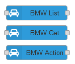

# Node-RED nodes for BMW ConnectedDrive

This package contains nodes to easily connect to BMW ConnectedDrive and read out informations about your vehicles.

NOTE: These nodes are unofficial and do NOT COME from BMW AG. Be careful when using these.

Be careful not to send your login and password to anyone other than BMW or you are giving away the authentication details required to control your car.

Also ensure that you don't overwhelm the BMW servers with requests. Calling REST APIs at very high frequency can put substantial load on the servers and might get your IP blocked by BMW.

## Disclaimer

Use these nodes at your own risk. The authors do not guaranteed the proper functioning of these nodes.
This code attempts to use the same interfaces used by the official BMW ConnectedDrive web portal.
However, it is possible that use of this code may cause unexpected damage for which nobody but you are responsible.
Use of these functions can change the settings on your car and may have negative consequences such as (but not limited to)
reducing the available charge in the battery.

## Installation

Install using the managed palette from inside Node-RED.

## Usage

There are 3 new nodes which appear in the category 'BMW' in your Node-Red palette.

### BMW List

Reads the list of cars, that are assigned to a BMW ConnectedDrive account.

Example Output:

    {
      "series":"2",
      "basicType":"M2",
      "bodyType":"Coupe",
      "brand":"BMW",
      "modelName":"M2",
      "vin":"WBSXXX",
      "licensePlate":"M2",
      "modelYearNA":null,
      "dcOnly":false,
      "hasNavi":true,
      "hasSunRoof":false,
      "doorCount":2,
      "maxFuel":null,
      "hasRex":false,
      "steering":"LEFT",
      "driveTrain":"CONV",
      "supportedChargingModes":[]
    }

### BMW Get

Read different informations about your car.

Example Output:

    {
    "attributesMap": {
        "updateTime_converted": "13.06.2019 16:56",
        "DCS_CCH_Ongoing ": null,
        "updateTime_converted_timestamp": "1560444966000",
        "gps_lat": "11.1111",
        "trunk_state": "CLOSED",
        "door_lock_state": "UNLOCKED",
        "condition_based_services": "00003,OK,2019-12,;00032,OK,2019-12,;00001,OK,2021-01,29000;00100,OK,2021-01,29000",
        "vehicle_tracking": "1",
        "hood_state": "CLOSED",
        "door_passenger_front": "CLOSED",
        "lastUpdateReason": "VEHCSHUTDOWN",
        "check_control_messages": "",
        "beRemainingRangeFuel": "511.0",
        "lights_parking": "OFF",
        "lsc_trigger": "VEHCSHUTDOWN",
        "unitOfEnergy": "kWh",
        "beRemainingRangeFuelKm": "511.0",
        "kombi_current_remaining_range_fuel": "511",
        "window_passenger_front": "CLOSED",
        "unitOfElectricConsumption": "kWh/100km",
        "door_driver_front": "CLOSED",
        "mileage": "12345",
        "head_unit_pu_software": "03/18",
        "updateTime": "13.06.2019 16:56:06 UTC",
        "DCS_CCH_Activation": null,
        "head_unit": "NBTEvo",
        "remaining_fuel": "43",
        "updateTime_converted_time": "16:56",
        "window_driver_front": "CLOSED",
        "beRemainingRangeFuelMile": "317.0",
        "gps_lng": "2.222222",
        "unitOfCombustionConsumption": "l/100km",
        "updateTime_converted_date": "13.06.2019",
        "unitOfLength": "km",
        "heading": "193"
    },
    "vehicleMessages": {
        "ccmMessages": [],
        "cbsMessages": [
            {
                "description": "Nächster Wechsel spätestens zum angegebenen Termin.",
                "text": "Bremsflüssigkeit",
                "id": 3,
                "status": "OK",
                "messageType": "CBS",
                "date": "2019-12"
            }
        ]}
    }

### BMW Action

Can be used to trigger a remote service on the car. This includes:

* Flash headlights
* Blow horn
* Lock door
* Unlock door
* Start climate
* Stop climate
* Find vehicle (update location)

### Additional Information

* For these nodes to work you need a car with BMW ConnectedDrive support and remote services.
* The different types of data that can be read depend on the type of car. Different cars support different services.

## History

* 2017-Dez-01: 0.1.0 - First prototype.
* 2018-Jan-26: 0.1.1 - Remove verbose logging of token code.
* 2019-Jun-17: 0.1.2 - Added diagnosis message if VIN has invalid format.
* 2021-Sep-08: 0.2.0
  * Refactored code to make token handling more stable. Token is no longer cached on disk.
  * Added service to get statistics of last trip and all trips.
  * Added service to get destinations.
  * Added service to get car status.
  * Fixed service to get charging profile.
  * Server now selected by region.
* 2021-Oct-04: 0.3.0
  * Added new node "BMW Action" to trigger a remote service on the car.
* 2022-Jan-22: 0.3.1 - Fix to support new API from "my BMW" (charging-statistics, charging-sessions).
* 2022-Jan-23: 0.3.2 - Added new remote command "Charge Now".

## Credits

* Sebastian Krauskopf (mail@sebakrau.de)

This project is heavily influenced by the work of:

* Nils Schneider (<https://github.com/Lyve1981/BMW-ConnectedDrive-JSON-Wrapper>)
* Sergej Müller (<https://github.com/sergejmueller/battery.ebiene.de>)
* Terence Eden (<https://github.com/edent/BMW-i-Remote>)
* bimmer_connected (<https://github.com/bimmerconnected/bimmer_connected>)

## Trademarks

"BMW ConnectedDrive" is a registered trademark of BMW AG.

## Licenses

The MIT License (MIT)

Copyright (c) 2017-2021 sebakrau (mail@sebakrau.de)

Permission is hereby granted, free of charge, to any person obtaining a copy
of this software and associated documentation files (the "Software"), to deal
in the Software without restriction, including without limitation the rights
to use, copy, modify, merge, publish, distribute, sublicense, and/or sell
copies of the Software, and to permit persons to whom the Software is
furnished to do so, subject to the following conditions:

The above copyright notice and this permission notice shall be included in all
copies or substantial portions of the Software.

THE SOFTWARE IS PROVIDED "AS IS", WITHOUT WARRANTY OF ANY KIND, EXPRESS OR
IMPLIED, INCLUDING BUT NOT LIMITED TO THE WARRANTIES OF MERCHANTABILITY,
FITNESS FOR A PARTICULAR PURPOSE AND NONINFRINGEMENT. IN NO EVENT SHALL THE
AUTHORS OR COPYRIGHT HOLDERS BE LIABLE FOR ANY CLAIM, DAMAGES OR OTHER
LIABILITY, WHETHER IN AN ACTION OF CONTRACT, TORT OR OTHERWISE, ARISING FROM,
OUT OF OR IN CONNECTION WITH THE SOFTWARE OR THE USE OR OTHER DEALINGS IN THE
SOFTWARE.

BSD 2-Clause License

Copyright (c) 2017, Nils Schneider
All rights reserved.

Redistribution and use in source and binary forms, with or without
modification, are permitted provided that the following conditions are met:

* Redistributions of source code must retain the above copyright notice, this
  list of conditions and the following disclaimer.

* Redistributions in binary form must reproduce the above copyright notice,
  this list of conditions and the following disclaimer in the documentation
  and/or other materials provided with the distribution.

THIS SOFTWARE IS PROVIDED BY THE COPYRIGHT HOLDERS AND CONTRIBUTORS "AS IS"
AND ANY EXPRESS OR IMPLIED WARRANTIES, INCLUDING, BUT NOT LIMITED TO, THE
IMPLIED WARRANTIES OF MERCHANTABILITY AND FITNESS FOR A PARTICULAR PURPOSE ARE
DISCLAIMED. IN NO EVENT SHALL THE COPYRIGHT HOLDER OR CONTRIBUTORS BE LIABLE
FOR ANY DIRECT, INDIRECT, INCIDENTAL, SPECIAL, EXEMPLARY, OR CONSEQUENTIAL
DAMAGES (INCLUDING, BUT NOT LIMITED TO, PROCUREMENT OF SUBSTITUTE GOODS OR
SERVICES; LOSS OF USE, DATA, OR PROFITS; OR BUSINESS INTERRUPTION) HOWEVER
CAUSED AND ON ANY THEORY OF LIABILITY, WHETHER IN CONTRACT, STRICT LIABILITY,
OR TORT (INCLUDING NEGLIGENCE OR OTHERWISE) ARISING IN ANY WAY OUT OF THE USE
OF THIS SOFTWARE, EVEN IF ADVISED OF THE POSSIBILITY OF SUCH DAMAGE.
